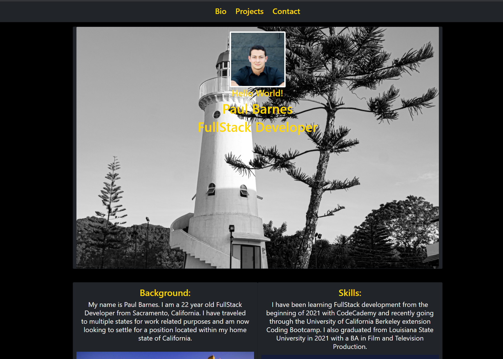
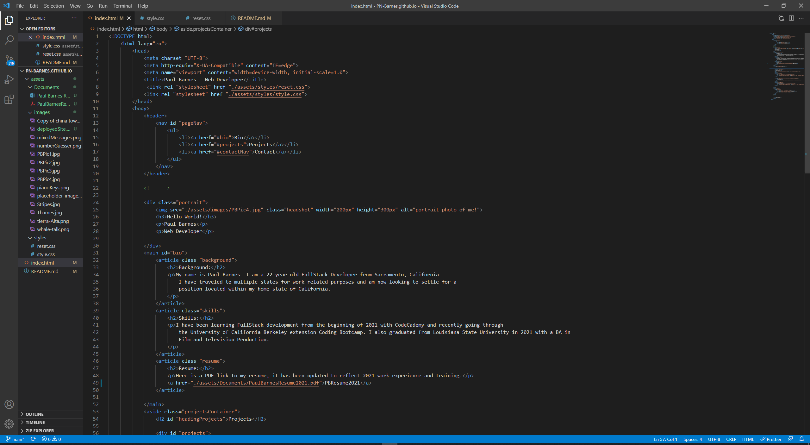
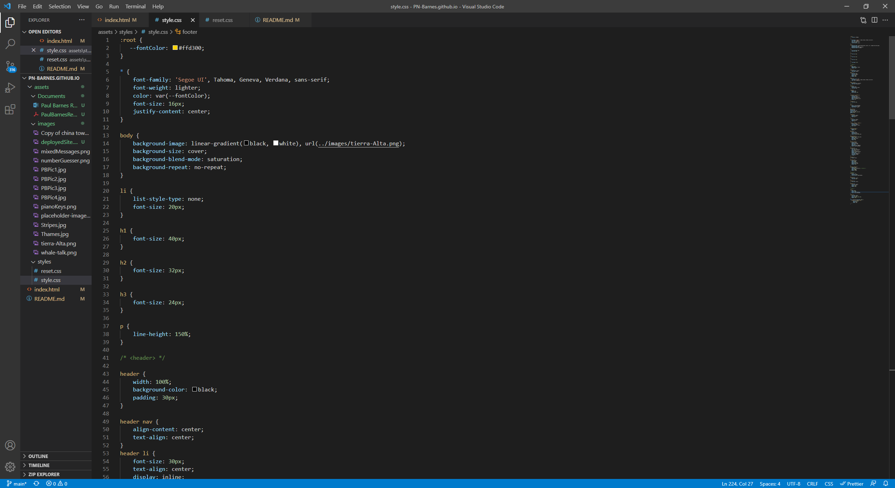

# PN-Barnes.github.io

# Introduction

Hello! Welcome to my Professional Portfolio Website. My name is Paul Barnes, I am a Fullstack Developer out of Sacramento California. This page is meant to show my background and skills as full stack developer. There are links and attachments for extra information on my work history as well as my educational background. Thank you for visiting my page and if you wish to contact me, click the 'Contact' link on the page. 

# Description

This website was created using HTML and CSS, without the use of any Javascript functionality through this first iteration of the page. This page is meant to follow semantic HTML format along with CSS styling practices used for those elements. All the work was done by myself and all code was produced by myself. Each heading tag are working links to navigate to specific points on the page as well as each project being a working link that will take you to the repository page of my other projects. 

# Install

Any form of text editor will suffice to run the code. There is no Javascript functionality at this point in time but will update the page over the coming months. The files will be located within the gitHub repository along with this readme.md file. Git bash will be needed in order to push changes through the main branch after approval from myself.

[Visual Studio Code](https://code.visualstudio.com/)

[GitHub Repository](https://github.com/PN-Barnes/PN-Barnes.github.io)

[Github](https://github.com/)

[git](https://git-scm.com/downloads)

# Feedback

If you would like to leave any feedback, reach out to me through any of the contact links listed within the page. My contact information will be listed under the "Contact" tab. 

# Usage

# Credits

**All code was written by Paul Barnes. All code seen was made through Visual Studio Code.**

© 2021 Trilogy Education Services, LLC, a 2U, Inc. brand. Confidential and Proprietary. All Rights Reserved.